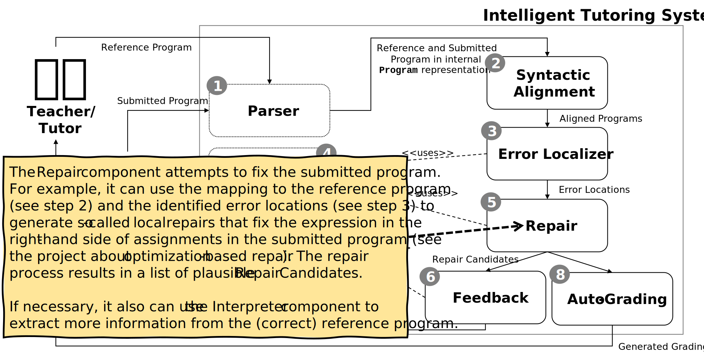

<!-- ## Workflow -->

The following steps show the intended workflow through the Intelligent Tutoring System (ITS). Note that there are points of variation (static and dynamic) that depend, e.g., on the programming language of the programming assignments and the intended repair strategies. Many of the current components can be implemented in many different ways.

## Overview

The Intelligent Tutoring System (ITS) uses the notion of a pipes-and-filter style to process the submitted program and, finally, to produce feedback for the students and a grading report for the tutor.
 
All components provide corresponding interfaces to the extent that most components can be implemented independently from each other.

This architecture also allows us to deploy specific system components as separate services. In this regard, the design borrows concepts from the service-oriented style. For example, we provide students with access to a Parser service that allows them to easily generate the internal CFG-based Program representation to create test cases for their projects.

## Step 1: Parser

## Step 2: Syntactic Alignment

## Step 3: Error Localizer

## Step 4: Interpreter

## Step 5: Repair

## Step 6: Feedback

## Step 7: Concretization

## Step 8: Auto-Grading
